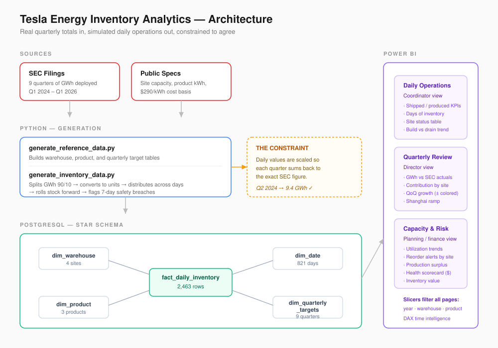

# Tesla Energy - Warehouse Inventory Analytics

[](https://python.org)
[](https://postgresql.org)
[](https://powerbi.microsoft.com)

A three-page Power BI dashboard tracking inventory across Tesla's energy storage factories, Q1 2024 to Q1 2026. Built on a PostgreSQL star schema with data generated in Python.

---

## Problem

Tesla reports one number per quarter for energy storage: gigawatt-hours deployed. Q4 2025 was 14.2 GWh, a record. Q1 2026 came in at 8.8. That's the entire public picture, nine numbers over nine quarters.

Behind those numbers, three factories were receiving cells, assembling Megapacks and Powerwalls, and shipping daily. Someone was watching stock levels and deciding whether Lathrop could cover next week's orders. None of that data is public.

So I rebuilt it. 2,463 rows of daily warehouse activity, generated with Python and constrained so the totals land exactly on Tesla's reported figures, then built the dashboard those teams would have used.



---

## Why three pages

A logistics coordinator at 7am and a finance director in a quarterly review are not looking for the same thing. One dashboard with everything on it serves neither.

| Page | Audience | Question |
|:--|:--|:--|
| Daily Operations | Logistics coordinator | Which site is running low, and is production keeping pace? |
| Quarterly Review | Director | Did we hit the number, and is growth holding? |
| Capacity & Risk | Planning / Finance | Where's the risk, and how much cash is frozen in inventory? |

Every visual had to answer one of those. Anything that didn't came off the page.

---

## Data

Real, from SEC filings: nine quarters of GWh deployed, site capacities, product specs, ~$290/kWh cost basis.

Simulated: 2,463 rows of daily activity, received, produced, shipped, closing stock, utilization, reorder flags, across 821 days, three active sites, two products.

The constraint is what makes the simulation defensible. Sum every generated daily shipment for Q2 2024, convert to GWh, and you get 9.4. The number Tesla reported. Same for all nine quarters. The quarterly chart on Page 2 is built entirely from generated data and reproduces Tesla's real deployment curve.

<details>
<summary>How the generation works</summary>

<br>

1. Split each quarter's GWh 90/10 between Megapack and Powerwall, inferred from earnings calls where Megapack consistently drives storage growth
2. Convert to unit counts using each product's kWh rating - Megapack 3.9 MWh, Powerwall 13.5 kWh
3. Distribute across the quarter's days with a normal distribution, then scale so daily values sum to exactly the quarterly target
4. Absorb rounding drift into day one, since whole units don't divide evenly
5. Roll stock forward daily: yesterday's close, plus produced, minus shipped
6. Flag any day closing stock falls below seven days of average demand

Shanghai returns zeros through 2024 because it wasn't producing yet. Houston has no rows at all — still under construction, but present in the warehouse dimension.

</details>

---

## Findings

**Unit counts hide where the money sits.** Nevada ships 643,701 Powerwalls; Lathrop ships 15,823 Megapacks. By energy, Lathrop delivers 61.7 GWh against Nevada's 8.7. By inventory value, Lathrop holds $230.7M against Nevada's $38.3M - six times the capital in 2% of the units. A director reading unit counts would send attention to the wrong site. Every metric on the dashboard is normalized to GWh or dollars because of this.

**The newest factory is the fragile one.**

| Site | Units shipped | Reorder alerts |
|:--|--:|--:|
| Gigafactory Nevada | 643,701 | 0 |
| Megafactory Lathrop | 15,823 | 4 |
| Megafactory Shanghai | 4,227 | 27 |

Shanghai ships the least and triggers 87% of stock alerts. Nevada ships the most and never triggers one. High-volume steady demand self-stabilizes; low-volume ramping production doesn't. Two hot shipping days can clear a week of Shanghai's cover.

**Q1 2026 was demand, not production.** After the 14.2 GWh record, Q1 2026 dropped 38% to 8.8. Production surplus stayed positive throughout, factories kept building and inventory kept accumulating. Nothing broke on the supply side.

---

## What went wrong

<details>
<summary>The alert that never fired</summary>

<br>

The first generator started every quarter with stock at 12% of quarterly volume against a 7% safety threshold, with production running 5% above shipments. Stock could only go up. Zero alerts across 2,463 rows, and I didn't catch it until the Power BI card rendered blank.

| Attempt | Alert days | Verdict |
|:--|--:|:--|
| Original | 0 | Dead sensor |
| Tighten the gap | 825 | 33% of days, alarm fatigue |
| Tighten further | 522 | Still noise |
| Tighter again | 305 | Still noise |
| Redefine the threshold | 31 | 1.3% of days |

The fix wasn't a better number, it was recognizing the definition was wrong. A fixed percentage of quarterly volume is not how warehouses set safety stock. Rewriting it as seven days of average daily demand, the standard approach, gave 31 alerts, concentrated where you'd expect, and made the metric mean something.

</details>

<details>
<summary>Time intelligence returning the wrong quarter</summary>

<br>

The QoQ measure kept returning each quarter's own value instead of the previous one. The DAX was fine. The visual was slicing by a quarter label from the fact table rather than the marked date dimension, so DATEADD had no date context to shift against.

</details>

<details>
<summary>Nothing sorts itself</summary>

<br>

Months came out alphabetically, April, August, December. Quarters came out Q1 2024, Q1 2025, Q1 2026, Q2 2024. Every text column needed a numeric sort key built and explicitly assigned, in every table it appeared in.

</details>

<details>
<summary>Marking the date table broke a chart</summary>

<br>

Enabling the date table removed Power BI's auto date hierarchy, and a line chart silently fell back to plotting all 821 individual days. No error, no warning. Fixed with an explicit year_month column and its own sort key, which doesn't depend on hierarchies Power BI generates and removes on its own.

</details>

---

## Assumptions

- The 90/10 Megapack/Powerwall split is inferred from earnings commentary, not published
- $290/kWh is a blended installed cost; the two products have different real unit economics
- Production at 105% and inbound at 110% of shipments produces a realistic buffer, but the ratios are assumed
- Every calendar day is treated as a production day; weekend dampening would be more realistic, and the is_weekend flag exists to support it

---

## Running it

```bash
pip install -r requirements.txt
psql -U postgres -c "CREATE DATABASE tesla_energy_analytics;"

cd scripts
python generate_reference_data.py
python generate_inventory_data.py
python load_to_sql.py
```

Credentials go in `.env` at the project root:

```env
DB_HOST=localhost
DB_PORT=5432
DB_NAME=tesla_energy_analytics
DB_USER=postgres
DB_PASSWORD=your_password
```

Open the .pbix in `dashboards/` and refresh.

---

## Next

Product-specific cost instead of a blended rate. Weekend and holiday effects in the simulation. A forecast layer on shipments, which finance asks for before anything else. Rolling safety stock that recomputes against changing demand instead of once per quarter.

---

Stack: Python (pandas, numpy), PostgreSQL, Power BI (DAX), Git
Sources: Tesla Q1 2024 – Q1 2026 quarterly updates and 10-Q filings, [SEC EDGAR](https://www.sec.gov/edgar)
